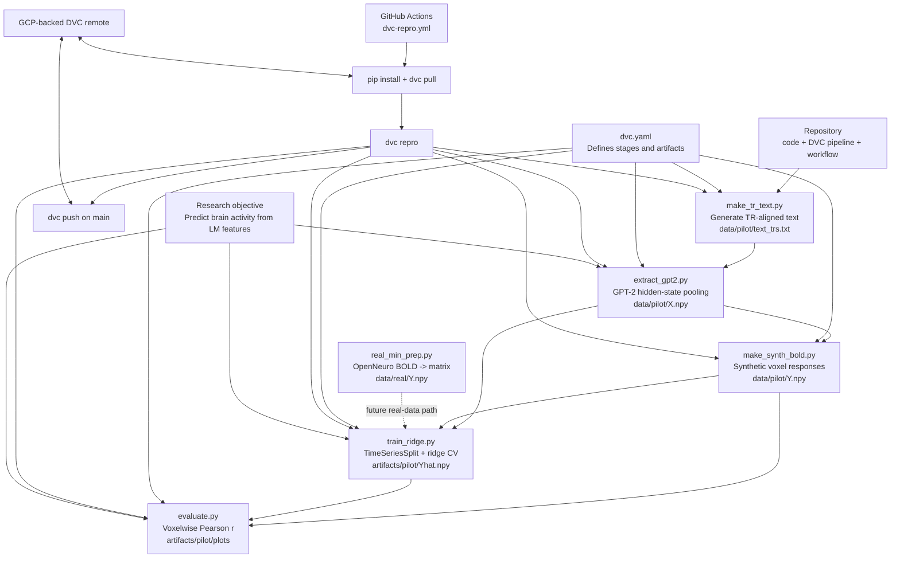

# cortexflow
CortexFlow is a reproducible MLOps framework for neuroscience experiments that predict brain activity from language model representations. The project demonstrates how modern ML infrastructure (DVC, cloud compute, versioned data, and modular pipelines) can support transparent and scalable computational neuroscience research.

## One-Page Diagram

This diagram reflects the repo as it exists today: a synthetic pilot pipeline that is fully reproducible through DVC, plus an initial path toward real fMRI data preparation.
