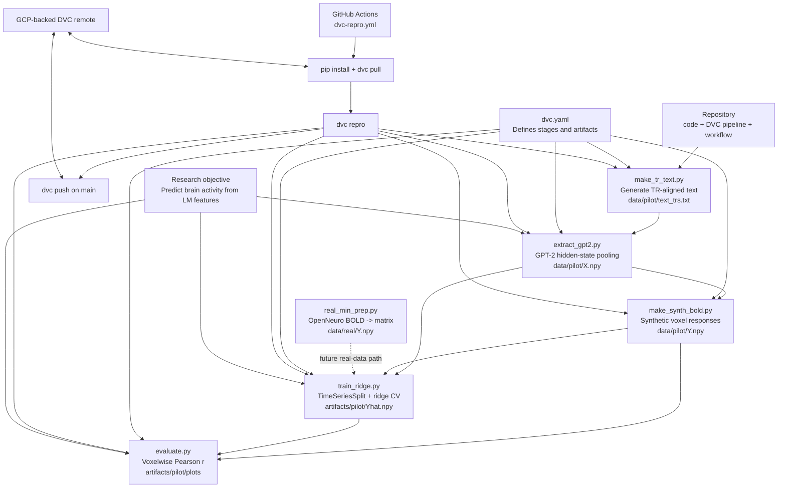

# cortexflow
CortexFlow is a reproducible MLOps framework for neuroscience experiments that predict brain activity from language model representations. The project demonstrates how modern ML infrastructure (DVC, cloud compute, versioned data, and modular pipelines) can support transparent and scalable computational neuroscience research.

## One-Page Diagram



This diagram reflects the repo as it exists today: a synthetic pilot pipeline that is fully reproducible through DVC, plus an initial path toward real fMRI data preparation.

## Mode Switching: Pilot vs. Final Data

CortexFlow supports seamless switching between **pilot** (synthetic, reproducible) and **final** (real fMRI data) modes.

### Quick Start

**Pilot mode** (synthetic data, for testing):
```bash
python -m cortexflow.cli switch pilot
python src/run_paper.py --mode pilot
# or
dvc repro paper
```

**Final mode** (real data, once available):
```bash
python -m cortexflow.cli switch final
python src/run_paper.py --mode final
# or
dvc repro paper
```

### Manage Modes

```bash
# Check current mode and configuration
python -m cortexflow.cli status

# View full config for a mode
python -m cortexflow.cli show pilot

# Switch modes
python -m cortexflow.cli switch final
```

See [MODE_SWITCHING.md](MODE_SWITCHING.md) for complete configuration details, data paths, and troubleshooting.

## Full Paper Reproduction Pipeline

This branch now includes a modular, config-driven pipeline in `src/cortexflow` that builds on top of the pilot scripts and supports end-to-end encoding model experiments aligned with the paper goal.

Implemented components:

- Transformer feature extraction from TR-aligned text (`src/cortexflow/features.py`)
- fMRI ingestion from either an existing matrix (`.npy`) or a NIfTI BOLD file (`src/cortexflow/fmri.py`)
- Delayed design matrix construction for hemodynamic alignment (`src/cortexflow/design.py`)
- Time-series cross-validated ridge encoding model (`src/cortexflow/modeling.py`)
- Voxelwise evaluation with Pearson `r`, `R^2`, and optional lateralization index (`src/cortexflow/metrics.py`)
- Single experiment runner with artifact export (`src/cortexflow/pipeline.py`, `src/run_paper.py`)

## Run The Full Pipeline

1. Install dependencies:

```bash
pip install -r requirements.txt
```

2. Use the provided config (defaults to pilot data so it runs immediately):

```bash
python src/run_paper.py --config configs/paper_reproduction.json
```

3. Or run via DVC:

```bash
dvc repro paper
```

Outputs are written to `artifacts/paper/`:

- `X_features.npy`: LM features per TR
- `Y_aligned.npy`: aligned fMRI matrix used for training/eval
- `Yhat.npy`: model predictions
- `corr_per_voxel.npy`: voxelwise Pearson correlations
- `r2_per_voxel.npy`: voxelwise coefficient of determination
- `corr_hist.png`: histogram of voxelwise correlation
- `metrics.json`: aggregate summary metrics

## Moving From Pilot To Real Data

Edit `configs/paper_reproduction.json`:

- Set `dataset.fmri_matrix` to `null`
- Set `dataset.fmri_nifti` to your preprocessed BOLD file
- Optionally set `dataset.mask_img` to constrain voxels
- Increase `dataset.max_voxels` and tune `training.alphas`
- Provide `evaluation.hemi_labels` (NumPy array with 0=left, 1=right) to compute lateralization index

## Notes

- Existing pilot scripts in `src/pilot/` are preserved for continuity and quick synthetic checks.
- The new pipeline is intentionally modular so you can add multiple model families/layers and multi-subject loops in subsequent commits without rewriting core logic.

## Google Cloud Compute

Yes, this framework works on Google Compute Engine for heavy training/evaluation.

- Full setup guide: `docs/GCP_COMPUTE_SETUP.md`
- DVC remote is already configured in `.dvc/config` for GCS.
- CI auth pattern is already present in `.github/workflows/dvc-repro.yml`.
